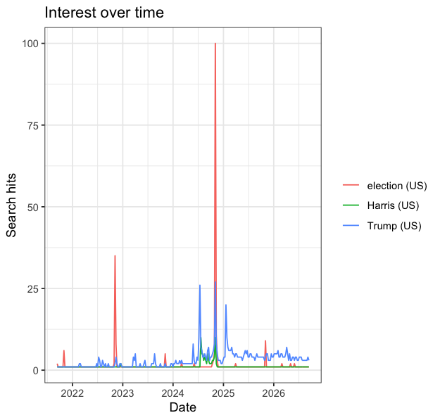
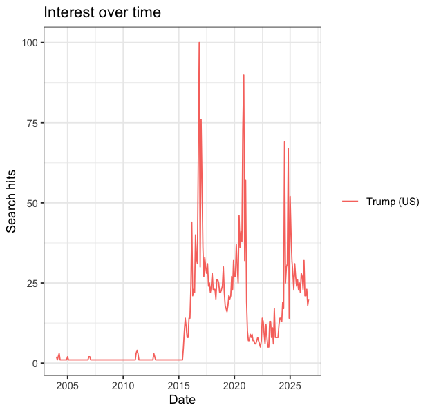
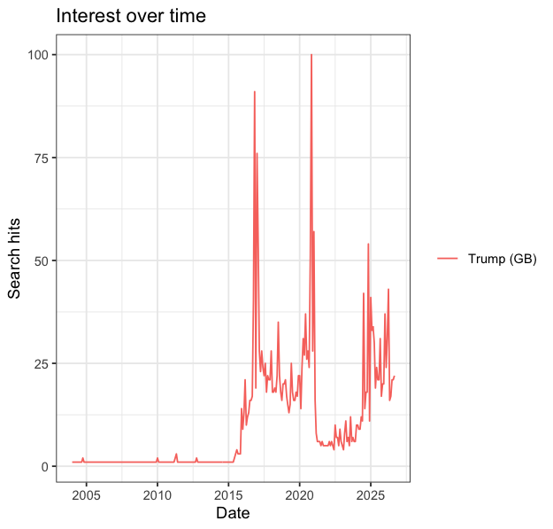
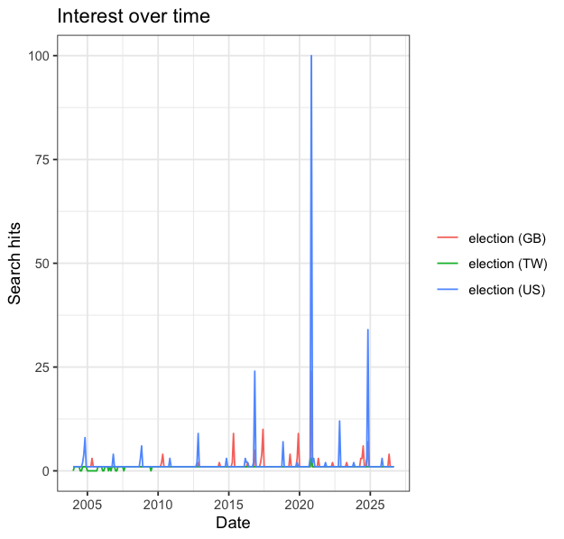
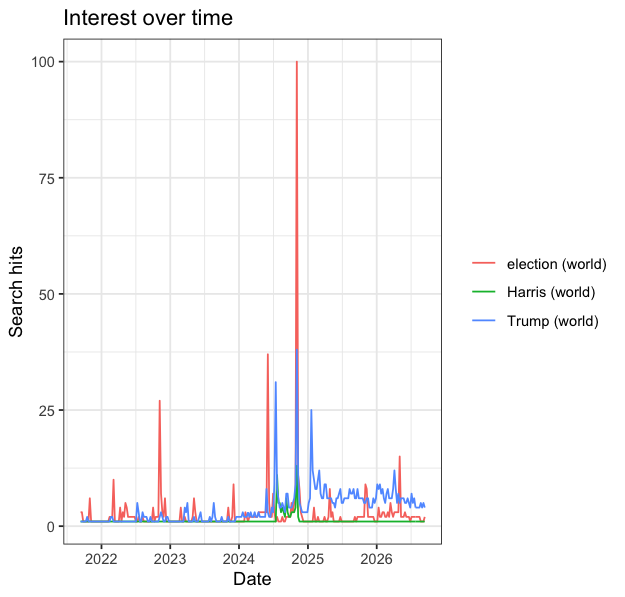

## **1. Query parameters** 

These include search terms, geography, time window, category, search type (web / news / images / YouTube), and the date and time I pulled it for reproducibility.

+-----------------------------------+---------------+--------------+----------------+-------------+--------------------+
| Search Term                       | Geography     | Time Window  | Category       | Search Type | Date & Time        |
+:=================================:+:=============:+:============:+:==============:+:===========:+:==================:+
| Trump                             | United States | Past Year    | All Categories | Web Search  | September 13, 2026 |
|                                   |               |              |                |             |                    |
|                                   |               |              |                |             | 15:11              |
+-----------------------------------+---------------+--------------+----------------+-------------+--------------------+
| Kamala Harris                     | United States | Past Year    | All Categories | Web Search  | September 13, 2026 |
|                                   |               |              |                |             |                    |
|                                   |               |              |                |             | 16:46              |
+-----------------------------------+---------------+--------------+----------------+-------------+--------------------+
| Election                          | United States | Past Year    | All Categories | Web Search  | September 13, 2026 |
|                                   |               |              |                |             |                    |
|                                   |               |              |                |             | 16:47              |
+-----------------------------------+---------------+--------------+----------------+-------------+--------------------+
| Trump, Kamala Harris and Election | United States | Past Year    | All Categories | Web Search  | September 13, 2026 |
|                                   |               |              |                |             |                    |
|                                   |               |              |                |             | 18:34              |
+-----------------------------------+---------------+--------------+----------------+-------------+--------------------+
| Trump, Kamala Harris and Election | United States | Past 5 Years | All Categories | Web Search  | September 13, 2026 |
|                                   |               |              |                |             |                    |
|                                   |               |              |                |             | 18:35              |
+-----------------------------------+---------------+--------------+----------------+-------------+--------------------+
| Trump and Election                | United States | Past Years   | All Categories | Web Search  | September 13, 2026 |
|                                   |               |              |                |             |                    |
|                                   |               |              |                |             | 18:35              |
+-----------------------------------+---------------+--------------+----------------+-------------+--------------------+
| Strait of Hormuz                  | United States | Past Year    | All Categories | Web Search  | September 13, 2026 |
|                                   |               |              |                |             |                    |
|                                   |               |              |                |             | 16:50              |
+-----------------------------------+---------------+--------------+----------------+-------------+--------------------+

: Query parameters from A.1.c

## 2. Observation

Trump, Kamala Harris and Election

- Range of dates: 2025/09/14 – 2026/09/13

- Interval: Weekly for the past year window. Changing the date window to past 5 years, interval changes to monthly.

- It’s a scale not count, normalized index from 0-100, 100 represents the peak for that query.

- Removing the search term Kamala Harris, the numbers for the remaining terms stay the same for each given week.

## 3. R Code

``` R
## EPPS 6302 Methods of Data Collection and Production
## Google Trends with R

install.packages("gtrendsR")
install.packages('readr')
library(readr)
library(gtrendsR)
TrumpHarrisElection <- gtrends(c("Trump","Harris","election"), 
                               onlyInterest = TRUE, 
                               geo = "US", 
                               gprop = "web", 
                               time = "today+5-y", # last five years
                               category = 0) 
the_df <- TrumpHarrisElection$interest_over_time
plot(TrumpHarrisElection)
tg <- gtrends("tariff", time = "all")
View(the_df)
write_csv(the_df, paste0("gtrends_us_5y_", Sys.Date(), ".csv"))


#working through the script
# one term, all of history
Trump2 <- gtrends(c("Trump"), 
                  onlyInterest = TRUE,
                  geo = "US", 
                  gprop = "web",
                  time = "all", # full history
                  category = 0) 
df2 <- Trump2$interest_over_time
View(df2)
plot(Trump2)

write_csv(df2, paste0("gtrends_trump_us_all_", Sys.Date(), ".csv"))

#same term in another country
Trump_GB <- gtrends(c("Trump"), 
                    onlyInterest = TRUE,
                    geo = "GB", 
                    gprop = "web",
                    time = "all", # full history
                    category = 0) 
df3 <- Trump_GB$interest_over_time
View(df3)
plot(Trump_GB)
write_csv(df3, paste0("gtrends_trump_GB_", Sys.Date(), ".csv"))


#one term across US, GB, TW
Election_GBUSTW <- gtrends(c("election"), 
                           onlyInterest = TRUE,
                           geo = c('US','GB','TW') , 
                           gprop = "web",
                           time = "all", # full history
                           category = 0) 
df4 <- Election_GBUSTW$interest_over_time
View(df4)
plot(Election_GBUSTW)
write_csv(df4, paste0("gtrends_election_GBUSTW_", Sys.Date(), ".csv"))


# three terms worldwide
TrumpHarrisElection_ww <- gtrends(c('Trump', 'Harris', 'election'), 
                                  onlyInterest = TRUE,
                                  geo = c('') , 
                                  gprop = "web",
                                  time = "today+5-y", 
                                  category = 0) 
df5 <- TrumpHarrisElection_ww$interest_over_time
View(df5)
plot(TrumpHarrisElection_ww)
write_csv(df5, paste0("gtrends_ww_5y_", Sys.Date(), ".csv"))


# three terms US, past year
TrumpHarrisElection_year <- gtrends(c('Trump', 'Harris', 'election'), 
                                    onlyInterest = TRUE,
                                    geo = c('US') , 
                                    gprop = "web",
                                    time = "today 12-m", 
                                    category = 0) 
df6 <- TrumpHarrisElection_year$interest_over_time
View(df6)
write_csv(df6, paste0("gtrends_us_12m_", Sys.Date(), ".csv"))

```

Observations: Using google trends in R, the df is composed of the following: `date`, `hits`, `keyword`, `geo`, `time`, `gprop`, `category`.

Downloading data straight from the google trends website gives:  time/date, term/keyword and hits.

The different imformation is time, gprop and category. Although some of this info is saved in the file name of the CSV but not on the dataset itself.

### Results 

{fig-align="center"}

{fig-align="center"}

{fig-align="center"}

{fig-align="center"}

{fig-align="center"}

**Difference between web search and script Harris:**

+---------------+---------------+-----------+----------------+------------+----------------+
|               |               |           |                |            |                |
+:=============:+:=============:+:=========:+:==============:+:==========:+:==============:+
| Kamala Harris | United States | Past Year | All Categories | Web Search | September 2026 |
+---------------+---------------+-----------+----------------+------------+----------------+

- Web search interval is monthly (61 entries) records every 01 of the month, script interval is weekly (262 entries per term) records start september 12.

- Because the observations occur at different intervals and dates, the individual hits values cannot be directly compared one-to-one.

**Harris is also a county, a supermarket chain, and several thousand other people. What does that gap tell you about the difference between a search term and the concept you meant to measure?**

The gap tells us that a search term is not necessarily the same as the concept we are trying to measure. Searching “Harris” captures interest in Kamala Harris, but it can also capture searches for Harris County, Harris Teeter, or other people and places. Therefore, the Google Trends value for “Harris” may include unrelated searches and is only an imperfect measure of interest in Kamala Harris.

## 4. Method Comparison

- *Are the numbers identical? If not, by how much, and in which direction?*

The numbers are not identical, although the two series are very similar. I changed the time range from the past five years to the past 12 months for both methods so that both the Google Trends website and the R script produced weekly observations on the same dates. This makes it possible to compare the values directly. For example, for “Trump” on September 14, 2025, the website shows 44 while the R script shows 42, a difference of 2 points, with the R value lower. On October 19, 2025, the website shows 48 while R shows 51, so the R value is 3 points higher. Some observations are identical, such as “election” on November 2, 2025, when both show 100. Overall, the differences are relatively small and can occur in either direction.

- *What are the differences between the two methods?*

1.  **Reproducibility**: Neither method guarantees that someone else could regenerate my file exactly. The website file includes the retrieval date in its filename, but I had to create a separate table to record the query settings so that I could repeat the search. The R method is more reproducible in terms of the query itself because the dataframe records the keyword, geographic location, time period, search property, and category. However, it does not record the date and time when the data were retrieved. Since Google Trends data can change between pulls, the retrieval date and time would also be useful for reproducing the exact file.

2.  **Provenance**: The R method records more of the query parameters directly in the dataframe. For example, my `the_df` file includes keyword, `geo`, `time`, `gprop`, and `category`. The website download does not provide these parameters in the same way, so I had to create a separate table documenting my query parameters. However, the website file name does preserve the date of retrieval, which is information missing from the R dataframe.

3.  **Scale**: The R method scales much better. I can modify the list of search terms in the code and run the query without manually entering and downloading each group of terms. With the website, working with fifty terms would require much more manual work and could also be limited by how many terms can be compared at once.

4.  **Fragility**: In terms of human error, the website retrieval is more fragile because one could accidentally change a setting without realizing, or be unable to reproduce the data if the query was not saved. However, the gtrendsR package’s fragility is more out of our control. For instance, as we’ve learned in class, Google can change how its trends interface or API works, they might disable this package, or there might be a bug in the package code. In the website you wouldn’t know unless you compare values with a previous search with the same queries otherwise you wouldn’t ever notice. For the R package, R will most likely give an error if there is a bug with the package code or if it’s no longer available.
