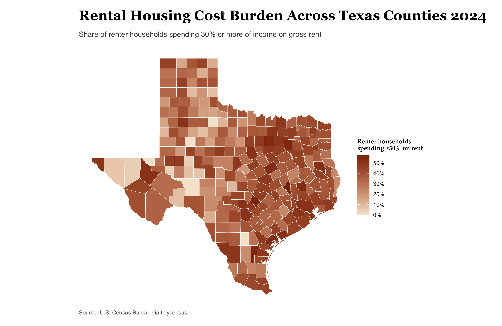

------------------------------------------------------------------------

## Research Question

**What is the distribution of rental housing cost burden across Texas counties?**

I measure rental housing cost burden as the share of renter households that spend 30% or more of their household income on gross rent. I also examine median household income as a second measure of the socioeconomic conditions of each county.

## 1. Setup

```{r}

# Packages

library(tidycensus)
library(tigris)
library(sf)
library(dplyr)
library(tidyr)
library(ggplot2)
library(readr)

options(tigris_use_cache = TRUE)

```

```{r}
# Explore variables 

vars <- load_variables(2024, "acs5")

vars |>
  filter(name %in% c(
    "B25070_001",
    "B25070_007",
    "B25070_008",
    "B25070_009",
    "B25070_010",
    "B19013_001"
  ))

vars |>
  filter(grepl("^B25070", name))

vars |>
  filter(grepl("^B19013", name))
```

## 2. Select Geography and Variables

I use Texas counties because county-level geography allows for a statewide comparison while keeping the map readable.

The ACS table `B25070` provides the number of renter-occupied households by the percentage of income spent on gross rent. I combine the categories from 30% through 50% or more to create the numerator for the rent-burden rate.

I also use **`B19013`**, median household income, as a second variable.

```{r}
# Parameters

state_abbr <- "TX"
geo_level <- "county"

my_vars <- c(
  renters = "B25070_001",
  burden_30_35 = "B25070_007",
  burden_35_40 = "B25070_008",
  burden_40_50 = "B25070_009",
  burden_50_plus = "B25070_010",
  income = "B19013_001"
)

year_acs <- 2024
survey <- "acs5"
```

## 3. Check the Variables

```{r}

vars <- load_variables(2024, "acs5")

vars |>
  filter(name %in% c(
    "B25070_001",
    "B25070_007",
    "B25070_008",
    "B25070_009",
    "B25070_010",
    "B19013_001"
  ))
```

## 4. Download the ACS Data

I use the 2024 ACS 5-year estimates and keep the geometry so that the county-level data can be mapped.

```{r}
# Download, wide — one row per area, and the sf class survives

acs_wide <- get_acs(
  geography = geo_level,
  variables = my_vars,
  state = state_abbr,
  year = year_acs,
  survey = survey,
  geometry = TRUE,
  output = "wide"
)
```

## 5. Create the Rent-Burden Numerator

The rent-burden numerator is the number of renter households spending 30% or more mof their income on gross rent. I combine the four relevant ACS categories.

```{r}
# Derive a rate, and carry its margin of error through

acs_wide <- acs_wide |>
  mutate(
    burden_30_plusE =
      burden_30_35E +
      burden_35_40E +
      burden_40_50E +
      burden_50_plusE
  )
```

## 6. Calculate the Rent-Burden Rate

The denominator is the total number of renter-occupied households. I divide the number of households spending 30% or more of income on rent by the total number of renter households.

```{r}
acs_wide <- acs_wide |>
  mutate(
    burden_rate = burden_30_plusE / rentersE
  )
```

I then convert the rate to a percentage for easier interpretation.

```{r}
acs_wide <- acs_wide |>
  mutate(
    burden_pct = burden_rate * 100
  )
```

## 7. Carry the Margin of Error Through the Calculation

Because the numerator combines four ACS estimates, I first calculate its margin of error using `moe_sum()`.

```{r}
acs_wide <- acs_wide |>
  rowwise() |>
  mutate(
    burden_30_plusM = moe_sum(
      c(
        burden_30_35M,
        burden_35_40M,
        burden_40_50M,
        burden_50_plusM
      ),
      estimate = c(
        burden_30_35E,
        burden_35_40E,
        burden_40_50E,
        burden_50_plusE
      )
    )
  ) |>
  ungroup()
```

I then use `moe_prop()` to carry the uncertainty through the calculation of the rent-burden rate.

```{r}
acs_wide <- acs_wide |>
  mutate(
    burden_moe = moe_prop(
      burden_30_plusE,
      rentersE,
      burden_30_plusM,
      rentersM
    ),
    burden_moe_pct = burden_moe * 100
  )
```

## 8. Check the Results

```{r}
acs_wide |>
  select(
    NAME,
    burden_30_plusE,
    burden_30_plusM,
    rentersE,
    rentersM,
    burden_pct,
    burden_moe_pct
  ) |>
  slice_head(n = 10)
```

## 9. Map: Rental Housing Cost Burden

The map shows the share of renter households in each Texas county spending 30% or more of their income on gross rent.

```{r}
rent_burden_map <- ggplot(acs_wide) +
  geom_sf(
    aes(fill = burden_pct),
    color = "white",
    linewidth = 0.15
  ) +
  scale_fill_gradient(
    low = "#F5E6D3",
    high = "#8C2D04",
    name = "Renter households\nspending ≥30% on rent",
    labels = function(x) paste0(x, "%")
  ) +
  labs(
    title = "Where Rent Takes Up More of Household Income",
    subtitle = "Share of renter households spending 30% or more of income on gross rent, Texas counties",
    caption = "Source: U.S. Census Bureau, 2024 ACS 5-year estimates"
  ) +
  theme_void() +
  theme(
    text = element_text(family = "Arial"),
    
    plot.title = element_text(
      family = "Georgia",
      size = 20,
      face = "bold",
      hjust = 0,
      margin = margin(b = 8)
    ),
    
    plot.subtitle = element_text(
      family = "Arial",
      size = 10.5,
      color = "gray30",
      hjust = 0,
      margin = margin(b = 12)
    ),
    
    legend.position = "right",
    
    legend.title = element_text(
      family = "Arial",
      size = 9,
      face = "bold"
    ),
    
    legend.text = element_text(
      family = "Arial",
      size = 8
    ),
    
    plot.caption = element_text(
      family = "Arial",
      size = 8,
      color = "gray40",
      hjust = 0
    ),
    
    plot.margin = margin(15, 15, 15, 15)
  )
```

{fig-align="center"}

## 10. Table

## a) Highest-Income Counties

I rank counties by median household income and show the rent-burden estimate and its margin of error alongside income.

```{r}
top10_income <- acs_wide |>
  st_drop_geometry() |>
  arrange(desc(incomeE)) |>
  select(
    NAME,
    incomeE,
    incomeM,
    burden_pct,
    burden_moe_pct
  ) |>
  slice_head(n = 10)

top10_income
```

## b) Lowest-Income Counties

```{r}
bottom10_income <- acs_wide |>
  st_drop_geometry() |>
  arrange(incomeE) |>
  select(
    NAME,
    incomeE,
    incomeM,
    burden_pct,
    burden_moe_pct
  ) |>
  slice_head(n = 10)

bottom10_income
```

## c) Complete Table

```{r}
# 10) Table — top and bottom 10 counties by median household income

top10 <- acs_wide |>
  st_drop_geometry() |>
  arrange(desc(incomeE)) |>
  transmute(
    Group = "Top 10",
    County = NAME,
    `Median household income` = incomeE,
    `Income MOE` = incomeM,
    `Rent burden (%)` = burden_pct,
    `MOE (%)` = burden_moe_pct
  ) |>
  slice_head(n = 10)

bottom10 <- acs_wide |>
  st_drop_geometry() |>
  arrange(incomeE) |>
  transmute(
    Group = "Bottom 10",
    County = NAME,
    `Median household income` = incomeE,
    `Income MOE` = incomeM,
    `Rent burden (%)` = burden_pct,
    `MOE (%)` = burden_moe_pct
  ) |>
  slice_head(n = 10)

income_table <- bind_rows(top10, bottom10) |>
  mutate(
    `Median household income` =
      paste0("$", format(round(`Median household income`), big.mark = ",")),
    `Income MOE` =
      paste0("$", format(round(`Income MOE`), big.mark = ",")),
    `Rent burden (%)` =
      round(`Rent burden (%)`, 1),
    `MOE (%)` =
      round(`MOE (%)`, 1)
  )

knitr::kable(
  income_table,
  caption = "Top and Bottom 10 Texas Counties by Median Household Income",
  align = c("l", "l", "r", "r", "r", "r")
)
```

## 12. Uncertainty Check

To examine uncertainty, I calculate an interval around each rent-burden estimate using its ACS margin of error. I then check whether the intervals for adjacent counties in the table overlap.

```{r}
uncertainty_check <- top10_income |>
  mutate(
    lower = burden_pct - burden_moe_pct,
    upper = burden_pct + burden_moe_pct
  ) |>
  mutate(
    next_county = lead(NAME),
    next_lower = lead(lower),
    next_upper = lead(upper),
    overlap = lower <= next_upper & upper >= next_lower
  ) |>
  filter(overlap) |>
  slice_head(n = 1)

uncertainty_check
```

The code identifies Rockwall County and Collin County as a pair whose intervals overlap.

Rockwall County has an estimated rent-burden rate of 50.7%, with an interval from approximately 44.2% to 57.1%. Collin County has an estimated rate of 45.8%, with an interval from approximately 44.3% to 47.4%.

Because these intervals overlap, the difference between the two estimated rent-burden rates should be interpreted cautiously. The overlap does not change the ranking by median household income, but it shows that the difference in the accompanying rent-burden estimates is not clearly distinguishable given sampling uncertainty.

```{r}
# Save outputs
write_csv(st_drop_geometry(acs_wide),
          paste0("acs_", state_abbr, "_", year_acs, ".csv"))
```

## 13. Methods

This analysis uses 2024 ACS 5-year estimates to examine rental housing cost burden across Texas counties. County-level geography was selected because it provides a statewide comparison while remaining readable on a choropleth map. Rental housing cost burden is measured as the share of renter-occupied households spending 30% or more of household income on gross rent. The numerator combines households spending 30–34.9%, 35–39.9%, 40–49.9%, and 50% or more of income on rent, while total renter-occupied households provide the denominator. Median household income is included as a second socioeconomic measure. Because ACS estimates are based on samples, each estimate has a margin of error. I calculate and report the MOE for the rent-burden rate rather than treating the estimates as exact values. Overlapping confidence intervals indicate that small differences between counties should not automatically be interpreted as meaningful differences in the estimates.
